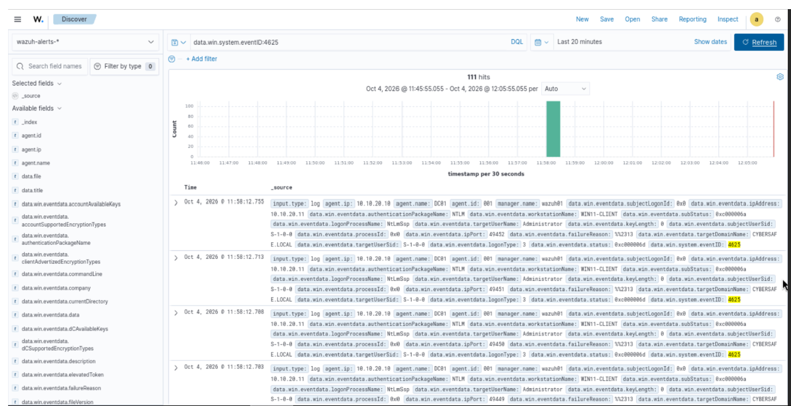
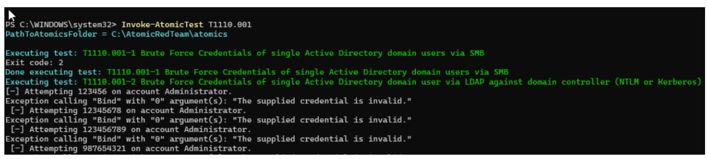

# Investigation Note — Brute Force / Password Guessing

**Project:** CyberSafe Home Lab — Phase: Attack & Detect (Detection Engineering)

## Summary

| Field | Value |
|-------|-------|
| **Technique** | T1110.001 — Brute Force: Password Guessing (MITRE ATT&CK) |
| **Detecting rule** | Wazuh rule **60122** — "Logon Failure – Unknown user or bad password" (level 5) |
| **Correlation alert** | Wazuh rule **60204** — "Multiple Windows Logon Failures" (level 10) |
| **Date/Time (DC01 local)** | 2026-10-04, 15:58:10 EDT |
| **Date/Time (Wazuh/SIEM)** | 2026-10-04, ~11:58 — see time-sync note below |
| **Target host** | DC01 (10.10.20.10) — domain controller |
| **Source host** | WIN11-CLIENT (10.10.20.11) |
| **Targeted account** | Administrator @ CYBERSAFE.LOCAL |
| **Verdict** | True positive — authorized simulated attack |

## What happened

- A rapid burst of failed logins hit DC01, logged as **Windows event 4625** ("An account failed to log on"), keyword `Audit Failure`.
- **Wazuh captured 111 failed-logon events** in the burst (event 4625), each triggering rule 60122.
- **Event Viewer on DC01 confirmed 384 total event-4625 Audit Failures** across the testing window — independent corroboration straight from the Windows Security log.
- Technical details of the attempts:
  - **Logon type 3** (network logon) — came in over the network, not from the console.
  - **Authentication package: NTLM** (`NtLmSsp`).
  - **Failure status: 0xC000006D** / reason `%%2313` = unknown username or bad password.
  - All attempts targeted the **Administrator** account from workstation **WIN11-CLIENT**.

*Figure 1 — Wazuh (Discover): 111 hits for `data.win.system.eventID:4625`, concentrated in one tight spike = the brute-force burst.*

*Figure 2 — End-to-end proof: the attack running in PowerShell (left), the Wazuh event detail showing targetUserName=Administrator and logonType 3 (middle), and the raw Event Viewer 4625 Audit Failures on DC01 (right).*

## Why it's suspicious (triage)

- One account, many wrong passwords, same source, all in a few seconds — humans don't fail that fast or that consistently.
- A single source hammering one account is the classic password-guessing signature.
- The volume (111 in the SIEM, 384 in the raw log) is far beyond any normal mistyped-password pattern.

## Verdict

- **True positive — authorized test.** Confirmed as a simulated attack (Atomic Red Team T1110.001 / controlled brute-force loop), not a real intrusion. In production, this exact pattern would be treated as a genuine brute-force attack.

## Action taken

- Verified the activity in **two independent sources** — Wazuh (rule 60122) and DC01's raw Security log (event 4625) — to corroborate.
- Confirmed the **built-in detection fired correctly**; no custom rule was needed for this technique.
- Recorded source host, target account, rule IDs, timestamps, and failure status as evidence.
- **Real-world response would be:** lock/reset the Administrator account, block the source IP at pfSense, and check for any *successful* logon (event 4624) from that source to rule out a breach.

## Analyst notes

- **Time-sync drift:** DC01's Windows log stamped the burst at 15:58 local, while the Wazuh SIEM indexed it around 11:58 — roughly a 4-hour skew between the endpoint and the SIEM. This matters: it caused events to fall outside default search windows during the investigation. Fix is to sync all hosts to the DC as the time source (`w32tm /resync`). Documenting it because clock drift is a real-world issue that hides evidence and can break Kerberos.
- **MITRE mislabel:** Wazuh auto-tags rule 60122 as `T1531 – Account Access Removal` by default. That is inaccurate for this activity; the correct technique is **T1110.001 Brute Force**, as labeled in the coverage matrix.
