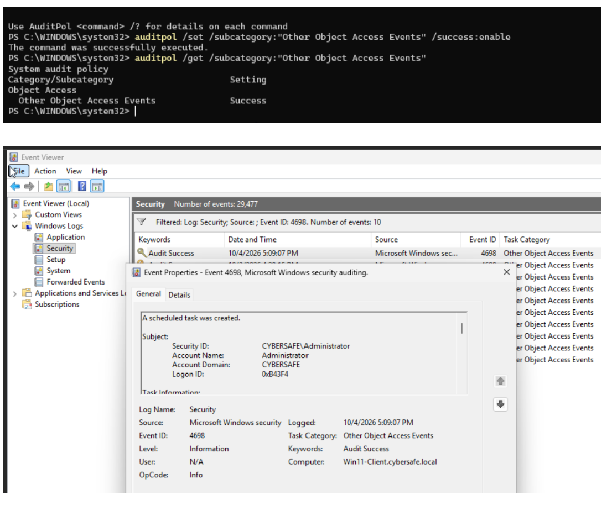
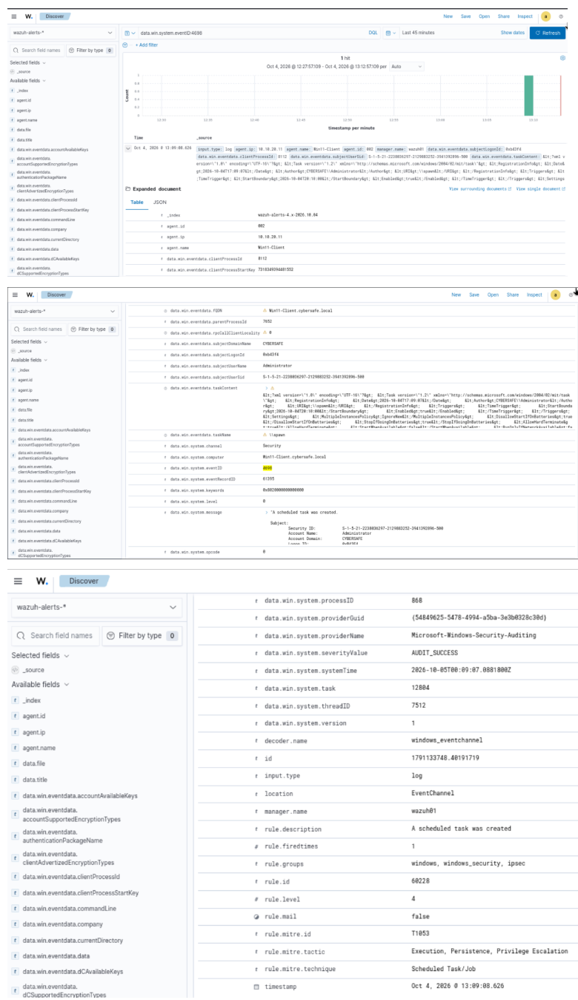

# Investigation Note — Scheduled Task Creation

**Project:** CyberSafe Home Lab — Phase: Attack & Detect (Detection Engineering)

## Summary

| Field | Value |
|-------|-------|
| **Technique** | T1053.005 — Scheduled Task/Job: Scheduled Task (MITRE ATT&CK) |
| **Detecting rule** | Wazuh rule **60228** — "A scheduled task was created" (level 4, built-in) |
| **Custom rule** | Wazuh rule **100210** — raises suspicious tasks to level 12 (detection-engineering add-on) |
| **Date/Time (Win11 local)** | 2026-10-04, 13:09:08 |
| **Date/Time (SIEM/UTC)** | 2026-10-05, 00:09:07Z — see time-sync note below |
| **Host (attack + detection)** | WIN11-CLIENT (10.10.20.11), agent 002 |
| **Created by** | Administrator @ CYBERSAFE |
| **Event ID** | 4698 — "A scheduled task was created" (`AUDIT_SUCCESS`) |
| **Verdict** | True positive — authorized simulated attack |

## What happened

- A new scheduled task was created on WIN11-CLIENT, logged as **Windows event 4698**.
- **Wazuh detected it** via built-in rule **60228** ("A scheduled task was created"), MITRE-tagged T1053 Scheduled Task/Job.
- The task's full definition (trigger, action, run level) is captured in the `data.win.eventdata.taskContent` field, and the creating account is recorded as **CYBERSAFE\Administrator**.
- Pre-work: had to enable the audit subcategory first — `auditpol /set /subcategory:"Other Object Access Events" /success:enable` — because event 4698 is **off by default**. Without it, the task creation would be invisible to the SIEM.

*Figure 1 — Source-side evidence: enabling the "Other Object Access Events" audit subcategory (top) and the Windows Security log on Win11-Client showing event 4698 "A scheduled task was created" by CYBERSAFE\Administrator (bottom).*

*Figure 2 — Wazuh (Discover): event 4698 on Win11-Client, rule 60228 "A scheduled task was created," created by CYBERSAFE\Administrator.*

## Why it matters — and the fidelity gap (triage)

- Scheduled tasks are a classic **persistence** mechanism: attackers use them to re-run malware on logon, on a timer, or at startup.
- **The catch:** rule 60228 fires at **level 4 (informational)** and triggers for *every* task created — malicious or routine Windows maintenance. On its own it is **not an actionable alert**; it would be buried in normal noise.
- This makes the detection **partial**: the SIEM *sees* the activity but doesn't *flag* it as suspicious.

## Verdict

- **True positive — authorized test.** Confirmed as a simulated attack (Atomic Red Team T1053.005, test 2 "Scheduled task Local"), not a real intrusion. In production this same event would be the starting point for a persistence investigation.

## Action taken

- Confirmed the event in Wazuh (rule 60228) and in DC/endpoint audit logging (event 4698).
- Verified the built-in detection fires but is low-fidelity (level 4).
- **Detection-engineering improvement:** wrote custom rule **100210**, which inspects `data.win.eventdata.taskContent` and raises tasks that run from user-writable/temp paths (AppData, Temp, VirtualStore, `.ps1`, PowerShell) to **level 12** — turning a buried info event into a real alert, while leaving normal task-creation noise at level 4.
- **Real-world response would be:** review the task (what it runs, trigger, author), disable/delete it if malicious, and hunt for how it was created.

## Analyst notes

- **Tuning win:** this is the "SIEM optimization / reduce false positives" story — the built-in rule alone is too noisy to action, so a targeted custom rule separates suspicious tasks from routine ones. That's the difference between "logged" and "detected."
- **Correct MITRE mapping:** Wazuh auto-tagged rule 60228 as **T1053 Scheduled Task/Job** (Execution / Persistence / Privilege Escalation) — accurate here, unlike the brute-force rule which mislabels as T1531.
- **Time-sync drift:** Win11 stamped the event at 13:09 local while the SIEM recorded ~00:09 UTC the next day — the same host/SIEM clock skew noted in the brute-force investigation. Syncing all hosts to the DC (`w32tm /resync`) keeps events inside expected search windows.
